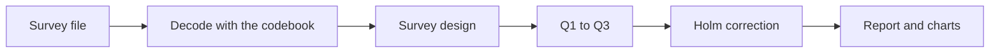
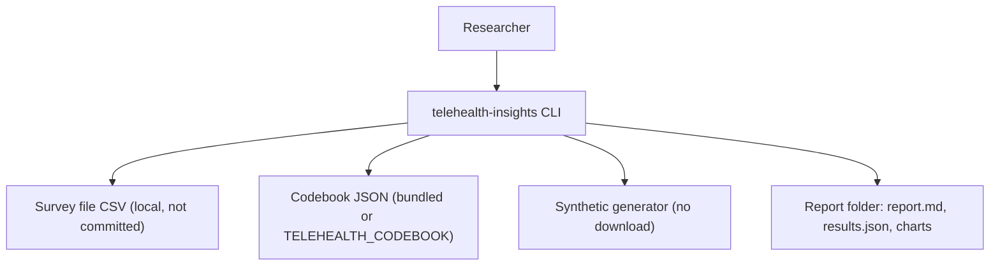
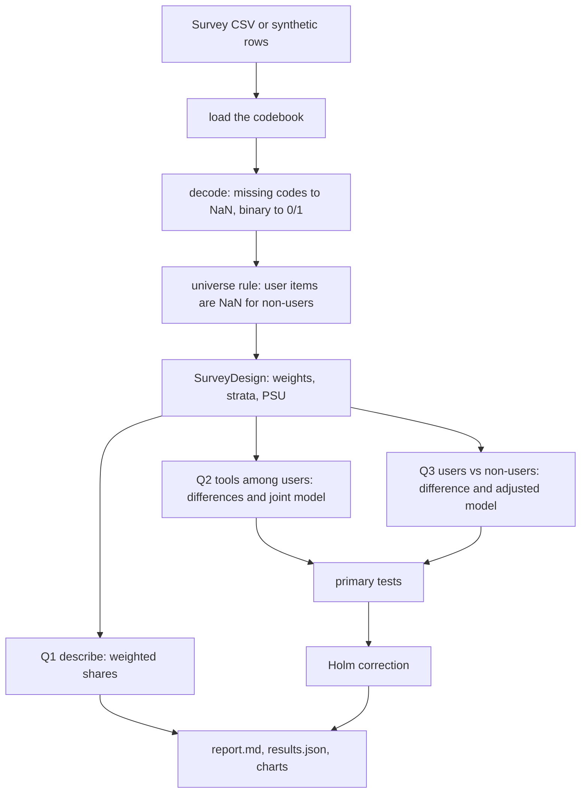

<div align="center">

# telehealth-insights — Survey-Weighted Telemedicine Analysis of the NEHRS Physician Survey

**telehealth-insights is a survey analysis kit for health-services researchers. It takes the NEHRS physician public-use file through these steps to a report with weighted estimates, adjusted odds ratios and charts:**

`decode codes` → `apply the survey design` → `describe` → `compare tools` → `compare users with non-users` → `correct` → `report`.


**[Summary](#1-summary)** ·
**[Workflow](#4-the-end-to-end-workflow)** ·
**[Run it](#10-how-to-run-telehealth-insights)** ·
**[Configuration](#104-environment-variables)** ·
**[Known problems](#13-known-problems)** ·
**[Glossary](#15-glossary)**

</div>

> [!NOTE]
> This README uses ASD-STE100 Simplified Technical English. The writing rules and the project
> vocabulary are in [`docs/ste-style-guide.md`](docs/ste-style-guide.md). Each term in the
> [Glossary](#15-glossary) has only one meaning.

---

> [!WARNING]
> Do not publish a result before you check the codebook. The bundled codebook contains working assumptions about column names and code values.
> Compare each entry with the official NCHS documentation, or load your own codebook with `TELEHEALTH_CODEBOOK`.

telehealth-insights asks three questions of the NEHRS physician survey, and each question fits the skip pattern of the survey.
A codebook decodes each column, so no missing code reaches an estimate.
Each estimate uses the survey weights and strata, and each standard error comes from Taylor linearisation.
Each chart is drawn from the estimates. No number in a chart is typed in by hand.

This README is the **one location that explains all of telehealth-insights**. It gives these topics:

- the general design
- each component and its procedure, step by step
- the decision rules
- the data map
- the runbook
- the validation results and the known problems

| If you are… | Read |
|---|---|
| A manager or reviewer | [1](#1-summary), [3](#3-design-rules), [4](#4-the-end-to-end-workflow), [12](#12-validation-results), [14](#14-key-points) |
| A developer who joins the project | All sections, in sequence. Keep [10](#10-how-to-run-telehealth-insights) and [13](#13-known-problems) open while you work |
| An operator who runs telehealth-insights | [10](#10-how-to-run-telehealth-insights), then the section for the component that you use |

---

## Table of contents

1. 🧭 [Summary](#1-summary)
2. 🏗️ [How telehealth-insights is built](#2-how-telehealth-insights-is-built)
   - 2.1 [Components](#21-components)
   - 2.2 [System context](#22-system-context)
   - 2.3 [Repository layout](#23-repository-layout)
3. 🛡️ [Design rules](#3-design-rules)
4. 🔄 [The end-to-end workflow](#4-the-end-to-end-workflow)
   - 4.1 [Full flow](#41-full-flow)
   - 4.2 [The life cycle of one analysis](#42-the-life-cycle-of-one-analysis)
5. 🔵 [The codebook and the decoder](#5-the-codebook-and-the-decoder)
6. 🟢 [The survey design](#6-the-survey-design)
7. 🟣 [The analysis questions](#7-the-analysis-questions)
8. ⚖️ [The decision rules and the report](#8-the-decision-rules-and-the-report)
9. 🗂️ [Data and file map](#9-data-and-file-map)
10. ▶️ [How to run telehealth-insights](#10-how-to-run-telehealth-insights)
    - 10.1 [Prerequisites](#101-prerequisites) · 10.2 [Installation](#102-installation) · 10.3 [Run telehealth-insights](#103-run-telehealth-insights) · 10.4 [Environment variables](#104-environment-variables)
11. 🧩 [How to extend telehealth-insights](#11-how-to-extend-telehealth-insights)
12. ✅ [Validation results](#12-validation-results)
13. ⚠️ [Known problems](#13-known-problems)
14. 📌 [Key points](#14-key-points)
15. 📖 [Glossary](#15-glossary)
16. 📄 [License](#16-license)

---

## 1. Summary

**The problem.** A researcher wants to know how physicians see telemedicine, from a national survey with a complex design. These questions are difficult:

- Which values are answers, and which values are skip or missing codes?
- Which physicians got each question?
- How do the survey weights and strata change the estimates and the standard errors?
- How do you compare tools when a physician can name more than one tool?
- How much of a difference between users and non-users comes from specialty, practice size and setting?

telehealth-insights gives each of these questions its own component. Each component is a pure function or a CLI command.

| Item | Value |
|---|---|
| Input | The NEHRS physician survey file (CSV), or synthetic rows with the same columns |
| Output | A report folder: `report.md`, `results.json` and 4 SVG charts |
| Components | **10** modules: config, codebook, decode, design, models, analyses, charts, report, synthetic, cli, plus the bundled codebook JSON |
| Methods | Weighted means and differences, weighted logistic regression, Holm correction, unweighted Mann-Whitney as a sensitivity check |
| Offline mode | All commands. No key and no network |
| Safety | An unknown code stops the decode. An answer from outside the universe becomes missing. The code checks that no negative code survives |
| Tests | **36** unit tests (`pytest`) |



---

## 2. How telehealth-insights is built

### 2.1 Components

| Component | Module | Purpose |
|---|---|---|
| Settings | `src/telehealth_insights/config.py` | Environment variables and a local `.env` loader |
| Codebook | `src/telehealth_insights/codebook.py` | Load and check the codebook JSON |
| Bundled codebook | `src/telehealth_insights/data/codebook_nehrs2021.json` | Column roles, codes and labels (working assumptions) |
| Decoder | `src/telehealth_insights/decode.py` | Missing codes to NaN, binary to 0/1, universe rule, decode report |
| Survey design | `src/telehealth_insights/design.py` | Weighted means, differences, linearised variance, Holm correction |
| Models | `src/telehealth_insights/models.py` | Weighted logistic regression with design-based standard errors |
| Analyses | `src/telehealth_insights/analyses.py` | Q1 to Q3, sensitivity checks, the primary test family |
| Charts | `src/telehealth_insights/charts.py` | SVG interval charts from the estimates |
| Report | `src/telehealth_insights/report.py` | `report.md`, `results.json`, `charts/` |
| Synthetic data | `src/telehealth_insights/synthetic.py` | Fake survey rows with skip codes and known effects |
| CLI | `src/telehealth_insights/cli.py` | The `telehealth-insights` command with 4 subcommands |

### 2.2 System context



### 2.3 Repository layout

```
telehealth-insights/
├── .github/workflows/ci.yml            # CI: Python 3.11, pip install -e ".[dev]", pytest -q
├── .env.example                        # 5 environment variables, all values empty
├── pyproject.toml                      # package, dev extra, telehealth-insights script
├── data/README.md                      # source, terms, expected columns
├── docs/ste-style-guide.md             # writing rules and project vocabulary
├── src/telehealth_insights/
│   ├── config.py  codebook.py          # settings and the codebook loader
│   ├── data/codebook_nehrs2021.json    # bundled codebook (check it against NCHS)
│   ├── decode.py  design.py            # decoder, survey design and Holm
│   ├── models.py  analyses.py          # weighted logistic regression, Q1 to Q3
│   ├── charts.py  report.py            # SVG charts and the Markdown report
│   └── synthetic.py  cli.py            # synthetic survey and the command line
└── tests/                              # 36 tests, no network, no download
```

---

## 3. Design rules

### 3.1 No missing code reaches an estimate
`decode` changes each negative code to NaN and counts it by reason. It then checks that no negative value is left. An unknown code stops the decode with `DecodeError`, unless you use `--lenient`.

### 3.2 Each question fits the skip pattern
Items for users only are NaN for non-users. Thus the quality and satisfaction items are compared among users only, and the documentation item is compared between users and non-users.

### 3.3 Each estimate uses the survey design
`SurveyDesign` uses the weights, the strata and the PSUs (if the codebook names a PSU column). Standard errors come from Taylor linearisation, and the CIs use a t distribution with PSUs minus strata degrees of freedom.

### 3.4 Effects come with intervals and a correction
Each comparison gives a difference in favourable share or an odds ratio with a 95 % CI. The 9 primary tests get Holm-adjusted p-values.

### 3.5 Each chart comes from the data
`charts.py` draws each SVG from the result dictionary. A test checks that a chart shows the value of the estimate.

### 3.6 Prototype problems and their fixes

| # | Problem in the earlier prototype | Fix in telehealth-insights |
|---|---|---|
| 1 | Skip codes (-6, -8, -9) were analysed as values | `decode` sets them to NaN and checks that none survive |
| 2 | The tool ANOVA used undefined names and the same column two times | One column and one label for each tool, from the codebook. Tools are compared one at a time and in one joint model |
| 3 | Two charts used typed-in numbers | All charts are drawn from the estimates |
| 4 | No survey weights | Weighted estimates, strata, optional PSUs, linearised variance |
| 5 | t-tests on Likert items, no effect sizes, no correction | Favourable share differences and odds ratios with CIs, Holm correction, Mann-Whitney as a sensitivity check |
| 6 | Physician quality was called a patient outcome | The report names each item for what it measures and lists this limit |
| 7 | Confounding was ignored | Adjusted models with specialty, practice size and setting |
| 8 | Inline installs, a reused variable, no codebook | A package with a CLI, a codebook file and tests |

---

## 4. The end-to-end workflow

### 4.1 Full flow



### 4.2 The life cycle of one analysis

1. The CLI reads `.env` and loads the codebook.
2. The CLI reads the survey CSV, or it generates synthetic rows.
3. `decode` checks the columns, the weights and each code.
4. `run_all` makes the `SurveyDesign`.
5. `describe` estimates the share of users and the distribution of each outcome.
6. `tool_comparisons` compares the users of each tool with the other users.
7. `exposure_comparisons` compares users with non-users, without and with controls.
8. `primary_tests` collects the 9 tests and adds the Holm p-values.
9. `write` saves the report, the JSON results and the charts.

---

## 5. The codebook and the decoder

**Purpose.** Give each column one role, one type and one set of valid codes, and decode the raw values with them.

| Codebook key | Meaning |
|---|---|
| `missing_codes` | Negative codes and their reasons |
| `design.weight`, `design.strata`, `design.psu`, `design.id` | Design columns. `weight` is necessary |
| `variables.<name>.role` | `exposure`, `outcome`, `tool` or `control` |
| `variables.<name>.type` | `binary` (`yes`, `no`), `ordinal` (`codes`, `favourable`) or `categorical` (`codes`) |
| `variables.<name>.universe` | `all physicians` or `telemedicine users` |

**Procedure (decode)**

1. Refuse a table that does not have each codebook column.
2. Refuse a weight that is missing, 0 or negative. Refuse a missing stratum or PSU.
3. For each item, count each missing code and each blank, then set them to NaN.
4. Refuse a code that is not valid for the item. With `--lenient`, set it to NaN and count it.
5. Change a binary item to 1.0 (yes) or 0.0 (no).
6. Set each users-only item to NaN for non-users. Count the answers that this removes.
7. Check that no negative value is left.

**Rules**

- The codebook must have exactly one exposure, and it must be binary.
- `favourable` must be a proper subset of `codes`.
- A valid code must not be negative.

---

## 6. The survey design

**Purpose.** Give design-based estimates, standard errors and confidence intervals.

| Estimate | Value | Influence value z_i |
|---|---|---|
| Mean in a domain | Σ w d y / Σ w d | w d (y − θ) / Σ w d |
| Difference of two domains | θ₁ − θ₀ | z₁ − z₀ |
| Logistic coefficients | Weighted pseudo-likelihood (Newton steps) | Score values w (y − p) x, sandwich A⁻¹ B A⁻¹ |

**Procedure (variance)**

1. Add the influence values of the rows in each PSU.
2. In each stratum, subtract the mean PSU total from each PSU total.
3. Multiply the sum of squares by n_h / (n_h − 1) and add the strata.
4. If a stratum has one PSU, centre it on the mean of all PSU totals.

**Rules**

- With no PSU column, each row is one PSU.
- Degrees of freedom = PSUs − strata. The CI uses the t quantile at 1 − α/2.
- A row with a missing outcome is outside the domain of that estimate.
- `weighted_logit` stops with `ConvergenceError` on a perfect separation.

---

## 7. The analysis questions

| Question | Outcome | Universe | Comparison | Model |
|---|---|---|---|---|
| Q1 | All outcomes and the exposure | Item universe | Weighted share of each code and favourable share | None |
| Q2 | `telemedqual`, `telemedsat` | Users | Users of each tool minus other users | Favourable ~ 4 tools + controls |
| Q3 | `timedoc` | All physicians | Users minus non-users | Favourable ~ telemedicine + controls |

**Procedure (Q2)**

1. Make the favourable indicator of the outcome.
2. For each tool, estimate the difference in favourable share among users.
3. Run the unweighted Mann-Whitney test of the raw codes as a sensitivity check. Report the rank-biserial effect.
4. Fit the joint weighted logistic model with all tools and the controls.

**Procedure (Q3)**

1. Make the favourable indicator of the outcome (for `timedoc`, the two highest time bands).
2. Estimate the unadjusted difference between users and non-users.
3. Run the unweighted Mann-Whitney test as a sensitivity check.
4. Fit the weighted logistic model with the exposure and the controls.

**Rules**

- A physician can name more than one tool, so the tool groups overlap. One ANOVA across tool groups is therefore not valid.
- The controls are categorical. The lowest code is the reference level.

---

## 8. The decision rules and the report

| Rule | Value |
|---|---|
| Significance level α | 0.05 (`TELEHEALTH_ALPHA`) |
| CI | 95 % for α = 0.05, t distribution |
| Primary test family | 4 tool differences for `telemedqual`, 4 for `telemedsat`, 1 adjusted odds ratio for `timedoc` |
| Correction | Holm step-down on the 9 primary p-values |
| Sensitivity check | Unweighted two-sided Mann-Whitney U, rank-biserial = 2U / (n₁ n₂) − 1 |
| Favourable codes | 4 and 5 for each ordinal outcome in the bundled codebook |

| Report file | Contents |
|---|---|
| `report.md` | Decode report, Q1 table, Q2 and Q3 tables, primary tests with Holm p-values, limits |
| `results.json` | All estimates, standard errors, CIs, p-values and model tables |
| `charts/favourable_shares.svg` | Favourable share of each outcome |
| `charts/tools_<outcome>.svg` | Tool differences with CIs |
| `charts/adjusted_timedoc.svg` | Adjusted odds ratios |

---

## 9. Data and file map

| Path | Committed? | Contents |
|---|---|---|
| `src/telehealth_insights/data/codebook_nehrs2021.json` | Yes | Bundled codebook |
| `data/README.md` | Yes | Source, terms and expected columns |
| `data/*.csv` | No (git ignores it) | The survey file or a synthetic file |
| `reports/<name>/` | No (git ignores it) | `report.md`, `results.json`, `charts/` |
| `.env.example` | Yes | All 5 environment variables, empty |
| `.env` | No (git ignores it) | Local settings |

---

## 10. How to run telehealth-insights

### 10.1 Prerequisites

| Need | For |
|---|---|
| Python 3.11+ | All components |
| numpy, pandas, scipy | Core (installed with the package) |
| The NEHRS 2021 physician CSV and its codebook | Results on the real survey (optional) |

### 10.2 Installation

```bash
git clone https://github.com/KrishnaAnnavaram/telehealth-insights.git
cd telehealth-insights
python -m venv .venv
. .venv/bin/activate            # Windows: .venv\Scripts\activate
pip install -e ".[dev]"
```

### 10.3 Run telehealth-insights

Offline (synthetic survey):

```bash
telehealth-insights analyze                                  # 4,000 synthetic rows -> reports/latest
telehealth-insights synth --rows 4000 --out data/synthetic_nehrs.csv
telehealth-insights decode data/synthetic_nehrs.csv          # missing-code report
telehealth-insights codebook                                 # roles, types, favourable codes
```

With the real survey file:

```bash
telehealth-insights decode data/NEHRS2021.csv                # check the codes first
telehealth-insights --codebook my_codebook.json analyze --data data/NEHRS2021.csv --out reports/nehrs2021
```

`python -m telehealth_insights` is the same as `telehealth-insights`.
An error prints `error: <message>`, and the exit code is 1.

### 10.4 Environment variables

| Variable | Used by | Meaning |
|---|---|---|
| `TELEHEALTH_DATA` | `analyze` | Survey CSV. Empty: synthetic rows |
| `TELEHEALTH_CODEBOOK` | All commands | Codebook JSON. Empty: the bundled codebook |
| `TELEHEALTH_OUTPUT` | `analyze` | Report folder. Default `reports/latest` |
| `TELEHEALTH_SEED` | `analyze` | Seed of the synthetic rows. Default 42 |
| `TELEHEALTH_ALPHA` | `analyze` | Significance level in (0, 0.5). Default 0.05 |

The CLI reads `--env-file` (default `.env`) first. A variable that is already set is not replaced.
The project needs no credentials.

---

## 11. How to extend telehealth-insights

| You want to… | Do this | Code change? |
|---|---|---|
| Use the real column names | Copy the codebook JSON, edit it, set `TELEHEALTH_CODEBOOK` | No |
| Add a PSU column | Set `design.psu` in the codebook | No |
| Add an outcome | Add a variable with `role: outcome` to the codebook | No |
| Add a control | Add a variable with `role: control` | No |
| Add another survey year | Make a codebook for that year | No |
| Add an ordinal model | Add a function next to `weighted_logit` in `models.py` | Yes |

Planned milestones (not built): a weighted proportional-odds model, replicate-weight variance and a comparison of survey years.

---

## 12. Validation results

| Validation | Result | Command |
|---|---|---|
| Unit tests | **36 passed** | `pytest -q` |
| Expected CI | 36 passed in a clean venv with `.[dev]` only (pandas 3.0, SciPy 1.18) | `.github/workflows/ci.yml` |
| Synthetic share of users | 0.640 [0.625, 0.655] | `telehealth-insights analyze` |
| Synthetic Q2, quality, video | +0.159 [+0.113, +0.205], Holm p < 0.0001 | `telehealth-insights analyze` |
| Synthetic Q2, quality, telephone | −0.079 [−0.122, −0.037], Holm p = 0.0012 | `telehealth-insights analyze` |
| Synthetic Q2, satisfaction, EHR-integrated platform | +0.203 [+0.157, +0.249], Holm p < 0.0001 | `telehealth-insights analyze` |
| Synthetic Q3, documentation | Unadjusted difference +0.135 [0.100, 0.169]. Adjusted odds ratio 1.332 [1.142, 1.555] | `telehealth-insights analyze` |

All synthetic numbers use 4,000 synthetic rows and seed 42.
The tests check the estimators against hand calculations: a classic standard error, a weighted 2 × 2 log odds ratio and Holm values.
The synthetic effects agree with the values in the generator. The adjusted odds ratio is smaller than the unadjusted one because specialty is a confounder.
No result on the real NEHRS file is in this README. The earlier prototype reported t = 121.7 and t = 95.5 (prototype result, not reproduced here). Those values compared answers with skip codes.

---

## 13. Known problems

Read these problems before you use telehealth-insights for a publication.

| # | Area | Problem | Impact and action |
|---|---|---|---|
| 1 | Codebook | The bundled column names and codes are working assumptions | Check each entry against the NCHS codebook before you publish |
| 2 | Design | The bundled codebook names no PSU column | If the file has PSUs, add them. Else the standard errors can be too small |
| 3 | Variance | No replicate weights | Linearisation only. Add replicate weights if NCHS gives them |
| 4 | Ordinal data | The models use a favourable indicator, not the full ordinal scale | A proportional-odds model is a planned milestone |
| 5 | Missing items | Item non-response is handled as missing at random inside each group | Read the decode report. Compare the results with an imputation if many items are missing |
| 6 | Causality | The survey is cross-sectional | The results are associations, not effects of telemedicine |
| 7 | Constructs | Quality and satisfaction are physician reports | Do not call them patient outcomes |
| 8 | Sensitivity check | The Mann-Whitney test ignores the weights | Use it only as a check of the weighted results |

**Responsible use.** This project is not medical advice and not a clinical decision tool. A person with survey and clinical knowledge must review each result. The survey covers office-based physicians, so the results do not describe other clinicians or patients.

---

## 14. Key points

1. **No missing code reaches an estimate.** The decoder sets each negative code to NaN and checks that none survive.
2. **Each question fits the skip pattern.** Quality and satisfaction are compared among users only.
3. **Each estimate uses the survey design.** Weights, strata and linearised standard errors give each CI.
4. **Tools are compared one at a time and jointly.** The tool groups overlap, so one ANOVA is not valid.
5. **Controls and a correction come with each test.** Adjusted odds ratios and Holm p-values are in the report.
6. **The full demo runs offline.** All 36 tests run without a download, a key or a network.

---

## 15. Glossary

| Term | Meaning |
|---|---|
| **Adjusted model** | Weighted logistic regression with the controls |
| **Codebook** | The JSON file with the role, type, codes and labels of each column |
| **Control** | A column in the adjusted model: specialty, practice size or setting |
| **Domain** | The rows that an estimate uses |
| **Exposure** | The `telemedicine` item |
| **Favourable share** | The weighted share of answers in the favourable codes |
| **Holm correction** | A step-down correction of p-values for a family of tests |
| **Missing code** | A negative code: -6, -7, -8 or -9 |
| **Non-user** | A physician who did not use telemedicine |
| **Primary test** | One of the 9 tests in the Holm family |
| **PSU** | Primary sampling unit |
| **Sensitivity check** | The unweighted Mann-Whitney test |
| **Skip pattern** | The survey rule that asks an item only of users |
| **Stratum** | A design group of the sample |
| **Taylor linearisation** | A variance method that uses the influence value of each row |
| **Tool** | One of the four telemedicine tool items. A user can name more than one |
| **Universe** | The physicians who get an item |
| **User** | A physician who used telemedicine |
| **Weight** | The survey weight of a respondent |

---

## 16. License

[MIT](LICENSE) © 2026 Krishna Annavaram
